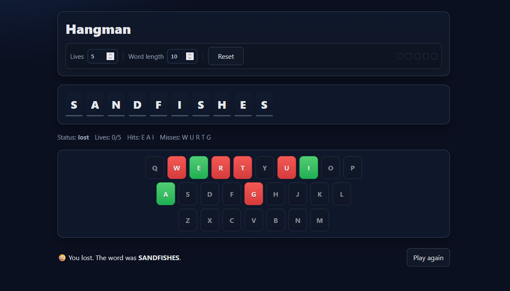

# 🎯 Hangman

A clean, responsive Hangman game built with **React + TypeScript + Vite**.  
It fetches random words from the [datamuse API](https://www.datamuse.com/api/) and challenges you to guess the word before you run out of lives!

Designed for **desktop and mobile**, with smooth UI and game feedback.



## 🕹️ Gameplay

- Press **Start Game**
- Guess letters using the on-screen keyboard
- Letters turn ✅ green (correct) or ❌ red (wrong)
- You have limited lives — run out, and it's game over!
- Start a new round instantly

## 📂 Project Structure

```txt
HANGMAN/
├─ .github/
│  └─ workflows/
│     └─ deploy.yml        # GitHub Pages deployment pipeline
├─ assets/                 # Static assets (images, icons)
├─ src/
│  ├─ components/
│  │  ├─ Game/
│  │  ├─ Header/
│  │  ├─ Key/
│  │  ├─ Keyboard/
│  │  ├─ ResultBanner/
│  │  ├─ StatusBar/
│  │  └─ WordDisplay/
│  ├─ hooks/
│  │  └─ useHangman.ts     # Main game logic state hook
│  ├─ styles/
│  │  └─ globals.css       # Global theme + UI styles
│  ├─ App.tsx
│  ├─ main.tsx
│  ├─ types.ts
│  └─ vite-env.d.ts
├─ index.html
├─ tsconfig.json
├─ vite.config.ts
└─ package.json
```

## 🚀 Tech Stack

- TypeScript
- React
- Vite
- HTML 5
- CSS 3
- [datamuse API](https://www.datamuse.com/api/)

## 📦 Development

```
npm install
npm run dev
npm run build
```

## 🌐 Deployment

Automatically deployed to GitHub Pages via Actions (see /github/workflows/deploy.yml).
